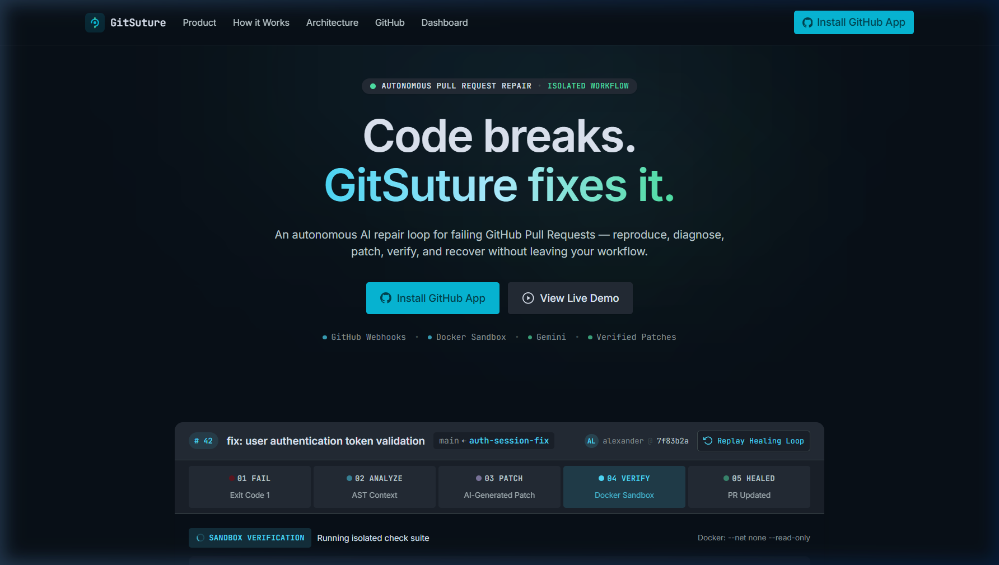

# GitSuture

> **Code breaks. GitSuture fixes it.**

GitSuture is an autonomous, three-agent local healing environment. It detects failing tests in a Pull Request, diagnoses the root cause using highly focused Abstract Syntax Tree (AST) code extraction and Gemini 2.5 Flash, generates a structured Unified Git Diff, and rigorously verifies the patch inside an isolated Docker sandbox before pushing the fix.

---

## ✨ What GitSuture Does

GitSuture replaces the manual cycle of pulling a broken branch, deciphering stack traces, and guessing fixes. It executes a strict, automated healing loop:

**Webhook Trigger** → **Job Queued** → **Agent 1 (Test Executor)** → **Agent 2 (Diagnosis & Repair)** → **Agent 3 (Patch & Verification)** → **Verified Result**

> **AI proposes the patch; deterministic execution and verification decide whether it is accepted.**

Crucially, GitSuture **does not blindly trust AI.** Every generated patch must be applied to the local repository and proven to pass the test suite inside a secure Docker sandbox. If the patch fails, GitSuture rolls back the code and retries (up to a strict limit of 3 attempts).

## 🎯 The Problem

Debugging failing Pull Requests is a highly repetitive, high-friction process. When a CI pipeline fails, developers must:
1. Context-switch and pull the failing branch locally.
2. Reproduce the failure and inspect the stack trace.
3. Locate the relevant code block amidst hundreds of files.
4. Formulate a fix, apply it, and rerun tests.
5. Repeat until the suite passes.

GitSuture automates this exact workflow, executing it locally and autonomously.

## 🧠 The Solution (3-Agent Architecture)

### Agent 1 — Test Executor (The Sandbox)
* Executes `npm test` safely on the cloned repository.
* Runs strictly inside an isolated Docker container.
* Captures and multiplexes `stdout` and `stderr` streams.
* Enforces strict resource limits (512MB RAM, 1 CPU Core) and a 45-second timeout.
* Network access is entirely disabled during execution to prevent malicious code behavior.

### Agent 2 — Diagnosis & Repair (The Brain)
* Parses the raw `stderr` stack trace to pinpoint the failing file and line number.
* **AST Pruning:** Uses Babel (`@babel/parser`, `@babel/traverse`) to extract *only* the specific enclosing function/class. It does not feed entire files to the LLM, massively reducing token usage and hallucination risk.
* Sends the focused context to Google's Gemini 2.5 Flash model.
* Enforces a strict `responseSchema` to guarantee structured JSON output containing:
  * `rootCauseAnalysis`
  * `confidenceScore`
  * `filePath`
  * `unifiedDiff`

### Agent 3 — Verification (The Hands)
* Applies the generated Unified Git Diff to the local file system using the `diff` library.
* Triggers Agent 1 to re-run the test suite on the patched code.
* If the test passes (Exit Code 0), returns a `VERIFIED` status.
* If the test fails, it executes a strict rollback to restore the repository to its original state.

## 🔄 Healing State Machine

GitSuture operates on a strict, observable state machine managed by the Orchestrator.

```text
[ QUEUED ]
   ↓
[ CLONING ]
   ↓
[ TESTING ]
   ↓
[ DIAGNOSING ]
   ↓
[ REPAIRING ]
   ↓
[ VERIFYING ]
   ↓
[ RESOLVED ] (or [ ESCALATED ] if max retries reached)
```

**Maximum Retry Limit:** The verification loop is strictly bounded. If Agent 3 fails to verify a patch after 3 attempts, the job is marked as FAILED/ESCALATED to prevent infinite hallucination loops.

## 🏗️ Architecture

```text
┌────────────────────────────────────────────────────────────┐
│                  GITHUB PULL REQUEST                       │
└─┬────────────────────────────────────────────────────────┬─┘
  │ Webhook Payload                           Octokit Push │
  ▼                                                        │
┌──────────────────────────────────────────────────────────┴─┐
│                    GITSUTURE CORE                          │
│                                                            │
│  ┌────────────────┐     ┌───────────────────────────────┐  │
│  │ Express API    │ ──> │ Orchestrator (State Machine)  │  │
│  │ (/api/webhooks)│     └─┬─────────────────────────────┘  │
│  └────────────────┘       │                                │
│                           ▼                                │
│  ┌──────────────────────────────────────────────────────┐  │
│  │              Agent 1 (Test Executor)                 │  │
│  │ └─ Docker Sandbox (npm test, Exit Code, Stderr)      │  │
│  └─┬────────────────────────────────────────────────────┘  │
│    │ (If Exit Code 1)                                      │
│    ▼                                                       │
│  ┌──────────────────────────────────────────────────────┐  │
│  │             Agent 2 (Diagnosis & Repair)             │  │
│  │ ├─ Babel AST Pruner (Extracts local context)         │  │
│  │ └─ Gemini 2.5 API (Structured JSON output)           │  │
│  └─┬────────────────────────────────────────────────────┘  │
│    │ (Unified Git Diff)                                    │
│    ▼                                                       │
│  ┌──────────────────────────────────────────────────────┐  │
│  │               Agent 3 (Patch & Verify)               │  │
│  │ ├─ Diff Library (Applies patch)                      │  │
│  │ └─ Loops back to Agent 1 for Verification            │  │
│  └──────────────────────────────────────────────────────┘  │
└─┬────────────────────────────────────────────────────────┬─┘
  │ Read/Write Job State                       Fetch State │
  ▼                                                        │
┌──────────────────┐                     ┌─────────────────┐
│ SQLite Database  │ <── Prisma Client ──> │ React Frontend  │
│   (Jobs, PRs)    │                     │ (Vite + 3D UI)  │
└──────────────────┘                     └─────────────────┘
```

## 🖥️ UI / Dashboard

The frontend is a premium, dark-mode developer tool interface built with React and Tailwind CSS.
* **Live PR Status:** Real-time polling of intercepted PRs and their healing state.
* **Healing Timeline:** Visual steps tracking the Orchestrator's progress.
* **Diagnostic Split-View:** Left pane shows the raw captured stderr; right pane shows the dynamically generated, code-formatted Unified Git Diff.

## 🧊 3D Visualization (Code Healing Field)

GitSuture features a high-end 3D visual layer built with React Three Fiber and Three.js.
* **Aesthetic:** A dark, abstract geometric network representing an intelligent dependency graph.
* **Interaction:** Smooth, expensive-feeling parallax that gently follows the mouse cursor.
* **Accents:** Subtle cyan/teal/green emissive nodes and thin connecting lines that match the GitSuture brand palette.
* **Performance:** The canvas is set to pointer-events: none to never interfere with UI clicks, and includes reduced-motion handling for mobile devices. (Note: This is a visualization layer representing the AI engine, not the engine itself).

## 🛡️ Safety & Reliability

GitSuture is designed with paranoia at its core:
* **Docker Sandboxing:** Untrusted code runs in a highly restricted container (`NetworkDisabled: true`, max 512MB RAM).
* **AST Pruning:** By using Babel, we send minimal context to the LLM, reducing the surface area for AI hallucinations.
* **Strict Verification:** No patch is pushed without passing `npm test` first.
* **Guaranteed Rollback:** Failed patches trigger an immediate filesystem restoration.
* **HMAC Security:** Webhook payloads are verified using SHA-256 signatures via `crypto.timingSafeEqual`.
* **Bounded Retries:** The system physically cannot loop more than 3 times on a single fix.

## 🧰 Tech Stack

| Domain | Technologies |
| :--- | :--- |
| **Frontend** | React, TypeScript, Vite, Tailwind CSS, React Three Fiber, Three.js |
| **Backend** | Node.js, TypeScript, Express |
| **AI / LLM** | Google Gemini API (gemini-2.5-flash), `@google/genai` SDK |
| **Execution** | Docker, dockerode |
| **Code Intelligence** | `@babel/parser`, `@babel/traverse` |
| **GitHub Ops** | `@octokit/rest`, `simple-git` |
| **Database** | Prisma, SQLite |
| **Testing** | Vitest (Mock API/Sandbox/Agent isolation tests) |

## 📁 Project Structure

```text
gitsuture-ai/
├── docker/            # Dockerfile configurations for the sandbox
├── frontend/          # React / Vite frontend application
│   ├── public/
│   └── src/
│       ├── components/ # UI components and 3D Scene.tsx
│       └── App.tsx     # Main dashboard and API integration
├── prisma/            # SQLite database schema and migrations
├── scripts/           # Utility scripts (e.g., trigger-mock-webhook.ts)
├── src/               # Backend source code
│   ├── agents/        # Agent 1 (Test), Agent 2 (Repair), Agent 3 (Verify)
│   ├── ast/           # Babel AST pruning engine
│   ├── config/        # Environment validation
│   ├── core/          # Orchestrator (State Machine) and Types
│   ├── db/            # Prisma client instantiation
│   ├── git/           # Octokit and simple-git operations
│   ├── sandbox/       # Dockerode wrapper and limits
│   └── server/        # Express setup, API routes, Webhooks
├── tests/             # Vitest suite (Agent mocks, Health, AST, Orchestrator)
├── .env.example
├── GITSUTURE_MASTER_SPEC.md
├── package.json
└── tsconfig.json
```

## ⚙️ Prerequisites

To run GitSuture locally, you need:
* **Node.js:** v18 or higher
* **npm:** Package manager
* **Docker Desktop / Engine:** Must be running in the background for Agent 1.
* **Gemini API Key:** From Google AI Studio.

## 🚀 Local Development Setup

Clone the repository:
```bash
git clone https://github.com/lamesahil/gitsuture-ai.git
cd gitsuture-ai
```

Install Backend Dependencies & Setup Database:
```bash
npm install
npx prisma db push
npx prisma generate
```

Install Frontend Dependencies:
```bash
cd frontend
npm install
cd ..
```

## 🚀 Production Deployment (VM)

GitSuture requires a **bare-metal Virtual Machine** (e.g., Ubuntu on DigitalOcean, AWS EC2, or Hetzner). Standard PaaS platforms (Vercel, Heroku) are incompatible because Agent 1 requires direct host access to the Docker daemon (`/var/run/docker.sock`) to spawn isolated sandboxes.

**Architecture:**
* Node.js / PM2 for the backend daemon.
* Caddy Reverse Proxy for HTTPS and static file serving.
* SQLite (`dev.db`) on the VM disk for persistence.

**Manual First-Time Setup on a Fresh Ubuntu VM:**
1. Clone the repository to `/opt/gitsuture`.
2. Run the bootstrap script as root: `sudo bash /opt/gitsuture/scripts/deploy.sh`. This installs Node 20, Docker, Caddy, PM2, and pre-pulls the Agent 1 image.
3. Create your `.env` file in `/opt/gitsuture` using `.env.example` as a template.
4. Copy `Caddyfile.example` to `/etc/caddy/Caddyfile` and replace the placeholder with your actual domain.
5. Reload Caddy (`sudo systemctl reload caddy`).
6. Run `npm install`, `npm run build`, and start the backend: `pm2 start ecosystem.config.js`.

## 🔐 Environment Variables

Create a `.env` file in the root directory. Use `.env.example` as a template:

```env
# Server
PORT=3001

# AI (Required for Agent 2)
GEMINI_API_KEY="your_gemini_api_key_here"

# Database
DATABASE_URL="file:./dev.db"

# GitHub Ops (Required for webhook ingestion and pushing via PAT)
GITHUB_WEBHOOK_SECRET="your_custom_secret_string"
GITHUB_TOKEN="your_personal_access_token_here"
```

## ▶️ Running Locally

You will need two terminal windows to run the application.

**Terminal 1: Start the Backend**
```bash
# From the root gitsuture-ai directory
npm run dev
```
*(Server will start on port 3001)*

**Terminal 2: Start the Frontend**
```bash
# From the root gitsuture-ai directory
cd frontend
npm run dev
```
*(Frontend will start on port 5173. Open http://localhost:5173 in your browser).*

## 🧪 Testing

The backend is fully tested using Vitest, with HTTP requests and Docker environments heavily mocked to ensure fast, reliable test execution.

To run the test suite:
```bash
npm test
```

**Test Coverage Includes:**
* Webhook HMAC validation.
* AST Extraction logic.
* Agent 2 Gemini prompt formatting (mocked).
* Agent 3 patch application and rollback logic.
* Orchestrator state machine transitions.

## 🎬 End-to-End Demo

To see GitSuture in action without configuring a live GitHub App, we have provided a mock webhook script that targets a deliberately broken repository (`gitsuture-demo-target`).

### The Verified Flow
When the webhook is triggered, you can observe the following strict progression in the logs and the UI:

**BROKEN TEST** → **QUEUED** → **CLONING** → **TESTING** → **DIAGNOSING** → **REPAIRING/PATCHING** → **VERIFYING** → **RESOLVED/HEALED**

### The Live Example
In our demo target, a function meant to calculate a sum was intentionally broken:
```javascript
// INTENTIONAL BUG: Returns a string concatenation instead of numeric sum
return a + "" + b;
```

During the flow:
1. **Agent 1** runs tests in Docker and captures the failure.
2. **Agent 2** diagnoses the exact line using AST extraction and generates the fix: `return a + b;`.
3. **Agent 3** applies the patch to the isolated clone and triggers Agent 1 again.
4. **Agent 1** confirms the tests pass. The commit is pushed, and the job is **HEALED**.

### Try It Locally
1. Ensure both the Backend and Frontend are running.
2. Ensure you have the `gitsuture-demo-target` repository cloned as a sibling directory (`../gitsuture-demo-target`).
3. Open a third terminal in the root directory and run:
   ```bash
   npm run mock:webhook
   ```
4. Look at your Dashboard (http://localhost:5173). You will see the webhook intercepted, the job queued, and the agents executing the healing loop in real-time.

## 📸 Screenshots

### Landing Page — Code Healing Field



*The hero section features a live 3D geometric network (React Three Fiber) representing GitSuture's intelligent dependency graph, alongside the real-time pipeline status strip: **01 FAIL → 02 ANALYZE → 03 PATCH → 04 VERIFY → 05 HEALED**.*

---

### Dashboard — Live HEALED Run


*A genuine, single-job clean state captured from the live E2E run. The sidebar shows **1 job**, the status badge reads **HEALED**, and every breadcrumb node in the timeline is lit — confirming the full `QUEUED → CLONING → TESTING → DIAGNOSING → VERIFYING → RESOLVED` state machine executed successfully.*

---

### Diagnostic Split-View — Agent 1 stderr · Agent 2 Patch · Agent 3 Verified


*Left pane: **Agent 1 (Docker Sandbox)** captures the raw Jest failure — `Expected: 15 / Received: "105"` — proving the string-concatenation bug. Right pane: **Agent 2 (Gemini)** generates the one-line unified diff (`- return a + "" + b` → `+ return a + b`), stamped **Agent 3 · Verified** after the second Docker sandbox run confirmed `exitCode=0`.*

## 🧩 Design Philosophy

GitSuture is built on the philosophy of **Verification over Blind Automation**. LLMs are probabilistic; software engineering requires determinism. By wrapping a generative model (Gemini) inside a deterministic execution sandbox (Docker + AST), we harness the reasoning capabilities of AI while strictly bounding its ability to hallucinate or break working systems.

## 🚧 Current Limitations

* **Local-First MVP:** Currently configured to clone and run in a local environment for demonstration purposes. Full cloud/CI integration requires provisioning isolated runner instances.
* **Ecosystem Support:** Agent 1 currently defaults to Node.js / `npm test`. Supporting Python, Go, or Rust requires expanding the Dockerfile configurations.
* **Authentication:** Currently uses Personal Access Tokens (PATs) via `simple-git`. A true production release would migrate to a fully authenticated GitHub App installation.

## 🔮 Future Improvements

* **Expanded AST Context:** Passing sibling files or imported interfaces to Agent 2 for more complex, multi-file refactors.
* **GitHub Checks API Integration:** Writing diagnostic summaries directly into the GitHub PR UI via the Checks API instead of just pushing commits.
* **Multi-Language Sandbox:** Dynamic Docker container provisioning based on the repository's primary language.

## 🏆 Why GitSuture?

GitSuture is not an AI chatbot that suggests code snippets for you to copy and paste. It is an end-to-end autonomous engineer. It creates a bounded Execution → Diagnosis → Patch → Verification loop, solving one of the most frustrating aspects of modern CI/CD pipelines natively and securely.

## 👤 Author

* **Author:** Sahil Tiwari
* **GitHub:** [https://github.com/lamesahil/gitsuture-ai](https://github.com/lamesahil/gitsuture-ai)

## 📄 License

MIT License
